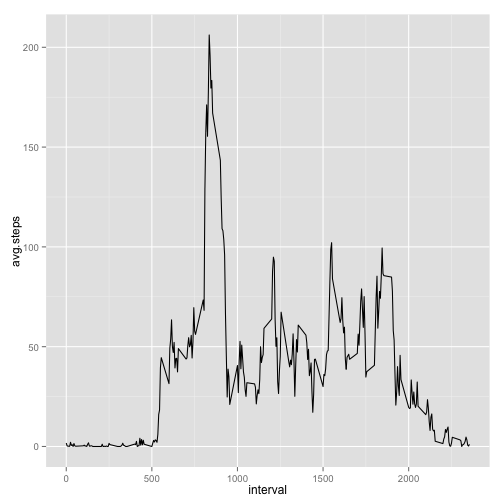
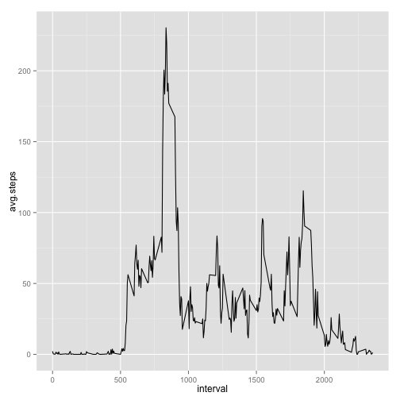
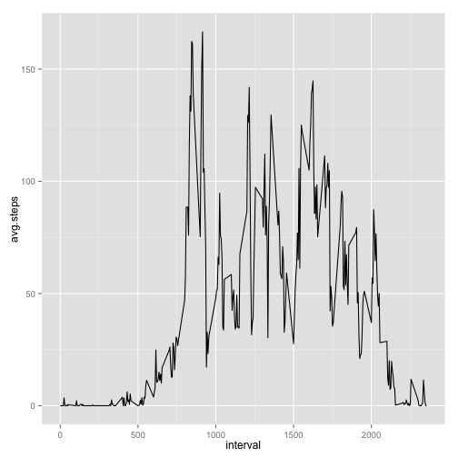

# Reproducible Research: Peer Assessment 1


## Loading and preprocessing the data

```r
library(data.table)
data<-fread("activity.csv")
#Convert date column to date field
data$date<-as.Date(data$date,format="%Y-%m-%d")
```


## What is mean total number of steps taken per day?

```r
library(plyr)
total_steps<-ddply(data,"date",summarise,total.steps=sum(steps,na.rm=T))
hist(total_steps$total.steps)
```

 
### Mean

```r
mean(total_steps$total.steps)
```

```
## [1] 9354
```
### Median

```r
median(total_steps$total.steps)
```

```
## [1] 10395
```
## What is the average daily activity pattern?

### 5 minute interval plot


```r
#We need ggplot for this
library(ggplot2)
#Lets summarize the data
interval_steps<-ddply(data,"interval",summarise,avg.steps=mean(steps,na.rm=T))
head(interval_steps)
```

```
##   interval avg.steps
## 1        0   1.71698
## 2        5   0.33962
## 3       10   0.13208
## 4       15   0.15094
## 5       20   0.07547
## 6       25   2.09434
```

```r
ggplot(data=interval_steps,aes(x=interval,y=avg.steps))+geom_line()
```

 

### The interval with maximum number of steps
It looks like most steps are taken at the 8:35 interval

```r
interval_steps[interval_steps$avg.steps==max(interval_steps$avg.steps),]
```

```
##     interval avg.steps
## 104      835     206.2
```


## Imputing missing values

Total Number of missing values


```r
nrow(data[is.na(steps),])
```

```
## [1] 2304
```

My strategy to impute these missing values is to get the average of the interval and populate the items


```r
#Lets copy our data set in to datax
datax<-data
for (i in 1:nrow(datax)){
  if(is.na(datax[i,steps])){
    datax[i,steps:=as.integer(interval_steps[interval_steps$interval==datax[i,interval],"avg.steps"])]
  }
}
```
### Histogram of Imputed data set

```r
#Lets create a histogram to see if this is different than the one on the top

total_steps_imputed<-ddply(datax,"date",summarise,total.steps=sum(steps,na.rm=T))
hist(total_steps_imputed$total.steps)
```

 
### Mean of Imputed data set

```r
mean(total_steps_imputed$total.steps)
```

```
## [1] 10750
```
### Median of Imputed data set

```r
median(total_steps_imputed$total.steps)
```

```
## [1] 10641
```

## Are there differences in activity patterns between weekdays and weekends?


```r
data[["day_of_week"]]<-weekdays(data[,date])
week_days<-data[day_of_week %in% c("Monday","Tuesday","Wednesday","Thursday","Friday")]
wd_interval_steps<-ddply(week_days,"interval",summarise,avg.steps=mean(steps,na.rm=T))
ggplot(data=wd_interval_steps,aes(x=interval,y=avg.steps))+geom_line()
```

 

```r
week_ends<-data[day_of_week %in% c("Saturday","Sunday")]
we_interval_steps<-ddply(week_ends,"interval",summarise,avg.steps=mean(steps,na.rm=T))
ggplot(data=we_interval_steps,aes(x=interval,y=avg.steps))+geom_line()
```

 

By looking at both the plots, its easy to tell that on weekdays the activity is mostly for going to work and coming back, during the day 
there is almost no activity.

But on weekends the pattern is activity during most of the day 

In both cases as we expect the steps are minimal during the night

